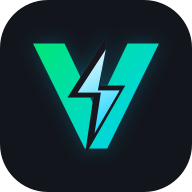
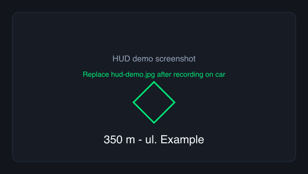

<div align="center">



# VoltFlow Nav

*Яндэкс Навігатар на прыборнай панэлі BYD (HUD)*

<p>
  <strong>Мова:</strong> Беларуская ·
  <a href="docs/README.en.md">English</a> ·
  <a href="docs/README.ru.md">Русский</a>
</p>

<p>
  <a href="https://github.com/scroodge/VoltFlow-Nav/blob/main/LICENSE"></a>
  <a href="https://github.com/scroodge/VoltFlow"></a>
  
  
</p>


</div>

**VoltFlow Nav** — свабодны мост з **Яндэкс Навігатара** на прыборную панэль **BYD DiLink 3.0** без root і без OpenBYD. Частка экасістэмы [VoltFlow](https://github.com/scroodge/VoltFlow) (зарядка, Mate-тэлеметрыя).

> **Адмова.** Праект не звязаны з Yandex, BYD ці AMap/Gaode. Усталёўка на свой рызыка. Патрабуюцца Accessibility і захоп экрана для чытання панэлі манёўраў Yandex.

## Што працуе сёння

<table>
<tr><th>Дысплей</th><th>Статус</th><th>v1.0</th></tr>
<tr><td><strong>Прыборная панэль (HUD)</strong></td><td>✓ Працуе</td><td>Стрэлкі манёўраў, вуліца (лаціна), ETA, рэштак маршруту</td></tr>
<tr><td><strong>Панэль кіравання (цэнтр)</strong></td><td>~ Эксперымент</td><td>Часткова; не абяцаем у v1.0</td></tr>
<tr><td><strong>Поўная падтрымка цэнтральнай панэлі</strong></td><td>Дорожная карта</td><td>Будучая версія</td></tr>
</table>



## Сумяшчальнасць

- **Аўтамабіль:** BYD Yuan UP (тэст)
- **DiLink:** 3.0 (`ro.build.product=DiLink3.0`, `ro.vehicle.type=Di3.0_3.5UI`)
- **Android:** 10
- **Навігатар:** `ru.yandex.yandexnavi`

## Хуткая ўстаноўка

1. Спампуйце APK з [Releases](https://github.com/scroodge/VoltFlow-Nav/releases) (`VoltFlowNav-*.apk`).
2. Усталюйце на галавную прыладу (файлавы менеджар або `adb install -r VoltFlowNav.apk`).
3. Адкрыйце **VoltFlow Nav** на аўтамабілі — сачыце за экранам наладкі.
4. Адзін раз з ПК (USB/Wi‑Fi ADB):

<details>
<summary>ADB: дазвол WRITE_SECURE_SETTINGS</summary>

```bash
adb connect <car-ip>:5555
adb shell pm grant com.bridge.yandexbyd android.permission.WRITE_SECURE_SETTINGS
```

</details>

5. На аўтамабілі: дазвольце **захоп экрана** (кнопка ў дадатку; пасля кожнай перазагрузкі).
6. **Не** запускайце навігацыю BYD AMap — яна блакуе староннія перадачы.
7. Запусціце маршрут у Yandex і трымайце Yandex **на экране**.

Наступныя версіі: у дадатку ўключыце **Правяраць абнаўленні пры запуску** — прапануе спампаваць новы APK з [GitHub Releases](https://github.com/scroodge/VoltFlow-Nav/releases), калі ён новей усталяванага.

## Як гэта працуе


```
Yandex Navigator
  ├─ AccessibilityService → адлегласць, вуліца, ETA
  └─ MediaProjection → стрэлка манёўра
        ↓
VoltFlow Nav → AUTONAVI_STANDARD_BROADCAST_SEND → com.example.amapservice → HUD
```

Тэхнічныя дэталі: [CLUSTER_PROTOCOL.md](CLUSTER_PROTOCOL.md), [YANDEX_UI.md](YANDEX_UI.md).

## Дакументацыя

| Тэма | Беларуская | English | Русский |
|------|------------|---------|---------|
| Удзел | [CONTRIBUTING.md](CONTRIBUTING.md) | [en](docs/CONTRIBUTING.en.md) | [ru](docs/CONTRIBUTING.ru.md) |
| Пратакол HUD | [CLUSTER_PROTOCOL.md](CLUSTER_PROTOCOL.md) | [en](docs/CLUSTER_PROTOCOL.en.md) | [ru](docs/CLUSTER_PROTOCOL.ru.md) |
| UI Yandex | [YANDEX_UI.md](YANDEX_UI.md) | [en](docs/YANDEX_UI.en.md) | [ru](docs/YANDEX_UI.ru.md) |
| Рэліз | [PUBLISH.md](docs/PUBLISH.md) | [en](docs/PUBLISH.en.md) | [ru](docs/PUBLISH.ru.md) |
| Маркетынг | [MARKETING_LAUNCH.md](docs/MARKETING_LAUNCH.md) | [en](docs/MARKETING_LAUNCH.en.md) | [ru](docs/MARKETING_LAUNCH.ru.md) |
| Патч OpenBYD | [PATCH_NOTES.md](openbyd-patch/PATCH_NOTES.md) | [en](docs/PATCH_NOTES.en.md) | [ru](docs/PATCH_NOTES.ru.md) |
| Changelog | [CHANGELOG.md](CHANGELOG.md) | — | [ru](docs/CHANGELOG.ru.md) · [be](docs/CHANGELOG.be.md) |

## Абмежаванні

- Yandex павінен быць **бачны** на экране падчас руху.
- Пасля **перазагрузкі** — зноў «Restart screen capture».
- Манёўры v1.0: у асноўным **лева / права / прама** (іншыя — у планах).
- Цэнтральная панэль — эксперыментальна.

## Дорожная карта

- Поўнае адлюстраванне на панэлі кіравання
- Дакладнейшыя манёўры (лёгкі/рэзкі паварот, разварот, кольца)

## Частка VoltFlow

| Прадукт | Спасылка |
|---------|----------|
| VoltFlow (зарядка, PWA) | [github.com/scroodge/VoltFlow](https://github.com/scroodge/VoltFlow) · [volt-flow-beige.vercel.app](https://volt-flow-beige.vercel.app/) |
| VoltFlow Mate (тэлеметрыя) | у рэпазіторыі VoltFlow |

## Падтрымаць праект

Свабодна і **MIT**. Добраахвотныя ахвяраванні дапамагаюць тэсціраваць на BYD і развіваць экасістэму VoltFlow:

- [Buy Me a Coffee — scroodge](https://buymeacoffee.com/scroodge)

## Зборка

```bash
./gradlew assembleDebug
# APK: app/build/outputs/apk/debug/VoltFlowNav-1.0.0-debug.apk
```

Логі: `adb logcat -s VoltFlowNav`

## Удзел

[CONTRIBUTING.md](CONTRIBUTING.md)

## Ліцэнзія

[MIT](LICENSE) — Alexey Washjurine (scroodge).
